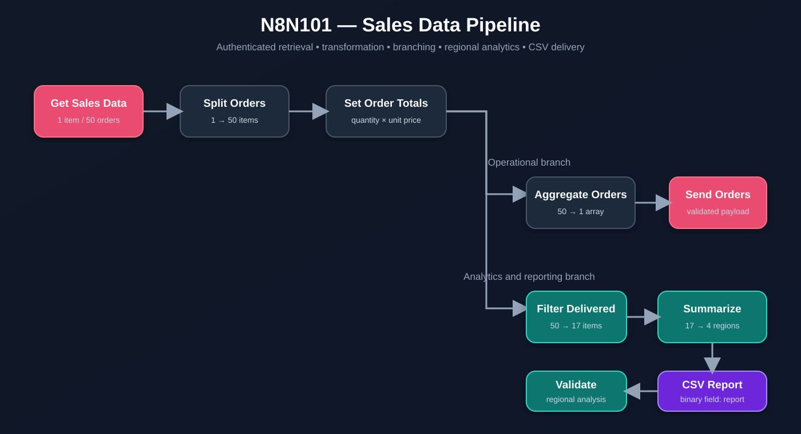

# Sales Data Pipeline

A complete n8n data-processing workflow developed for **Section 2 — Data Flow & Transformation** of the n8n Academy N8N101 Essentials course.

The pipeline retrieves 50 sales orders from an authenticated API, converts a nested array into individual n8n items, calculates order totals, creates parallel operational and analytical branches, summarizes delivered revenue by region, generates a CSV report, and uploads the resulting binary file.

## Architecture

## Data flow

| Stage | Node | Input → Output | Responsibility |
| --- | --- | --- | --- |
| Trigger | `TriggerManual` | 1 → 1 | Starts the workflow manually |
| Retrieval | `GetSalesData` | 1 → 1 | Retrieves a nested `orders` array with Header Auth |
| Split | `SplitOrders` | 1 → 50 | Converts the array into individual items |
| Transform | `SetOrderTotals` | 50 → 50 | Selects fields and calculates `quantity × unit_price` |
| Operational aggregation | `AggregateOrders` | 50 → 1 | Rebuilds the processed orders array |
| Operational validation | `SendOrders` | 1 → 1 | Sends the transformed dataset |
| Filter | `FilterDelivered` | 50 → 17 | Keeps orders whose status is `delivered` |
| Summary | `SummarizeByRegion` | 17 → 4 | Calculates sum, count, and average by region |
| Rename | `UpdateFieldNames` | 4 → 4 | Produces clear reporting field names |
| Analytics aggregation | `AggregateRegions` | 4 → 1 | Builds the regional analysis payload |
| Analytics validation | `SendAnalysis` | 1 → 1 | Sends the regional summary |
| Metadata | `SetReportMetadata` | 4 → 4 | Adds timestamp and assessment placeholder |
| File generation | `ConvertToCSV` | 4 → 1 binary | Creates the CSV in binary property `report` |
| Report upload | `SendReport` | 1 binary → 1 | Uploads the binary CSV report |

## Branching strategy

The output of `SetOrderTotals` feeds two independent branches:

- **All orders:** Aggregate → send the complete transformed dataset.
- **Delivered orders:** Filter → summarize → validate analysis and create the final report.

This design demonstrates how one normalized dataset can serve operational processing and analytical reporting without duplicating the initial retrieval and transformation stages.

## Expressions

| Purpose | Expression |
| --- | --- |
| Calculate total | `{{ $json.quantity * $json.unit_price }}` |
| Read current status | `{{ $json.status }}` |
| Create ISO timestamp | `{{ $now.toISO() }}` |
| Send orders as an array | `{{ { orders: $json.orders } }}` |
| Send regions as an array | `{{ { regions: $json.regions } }}` |

## Verified results

The completed assessment returned:

- 50 orders received and transformed
- 17 delivered orders
- 4 regional summaries
- Valid CSV report
- Successful Section 2 confirmation
- Skills verified: Header Authentication, Branching, Data Transformation, Expressions, Filtering, Aggregation, and File Generation

### Regional output

| Region | Revenue | Orders | Average |
| --- | ---: | ---: | ---: |
| North | 2932 | 8 | 366.50 |
| West | 375 | 4 | 93.75 |
| East | 226 | 2 | 113.00 |
| South | 536 | 3 | 178.67 |

## Troubleshooting completed

### Invalid URL

**Cause:** method text was accidentally pasted into the URL field.  
**Resolution:** keep only the complete `https://...` address in the URL parameter.

### HTTP 503 — no available server

**Cause:** temporary Academy endpoint unavailability.  
**Resolution:** retry after confirming the endpoint and node configuration.

### HTTP 422 — orders is a string instead of an array

**Cause:** the `orders` value was configured as text rather than a JSON array.  
**Resolution:** send a JSON body expression that preserves the array type.

### Binary field not found

**Cause:** `ConvertToCSV` and `SendReport` used different binary property names, including an accidental leading space.  
**Resolution:** configure both nodes with the exact property name `report`.

### Invalid DateTime

**Cause:** the timestamp expression did not resolve to a valid value.  
**Resolution:** use `{{ $now.toISO() }}`.

## Import and configuration

1. Download [`workflow.json`](./workflow.json).
2. Import it into n8n.
3. Assign your own Header Auth credential to all HTTP Request nodes.
4. Replace `YOUR_ASSESSMENT_ID` with your own value.
5. Execute the complete workflow from `TriggerManual`.
6. Never commit your personalized export back to a public repository.

## Public-export safety

This workflow is intentionally sanitized. It contains no real Assessment ID, credential reference, API key, workflow ID, or n8n instance metadata.
